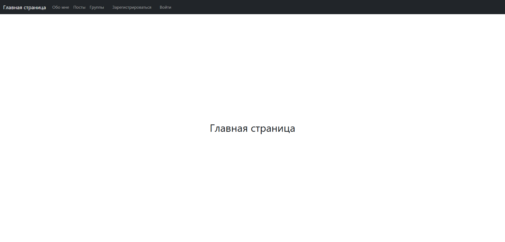
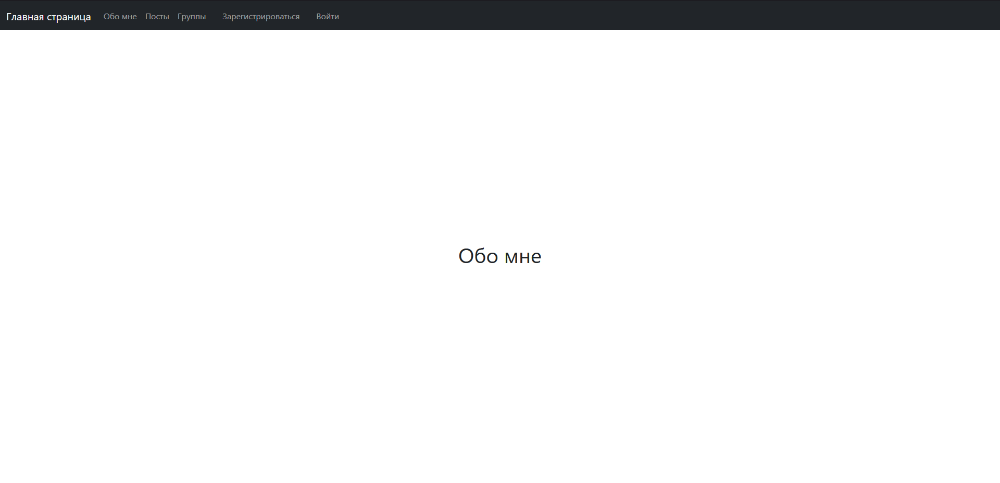
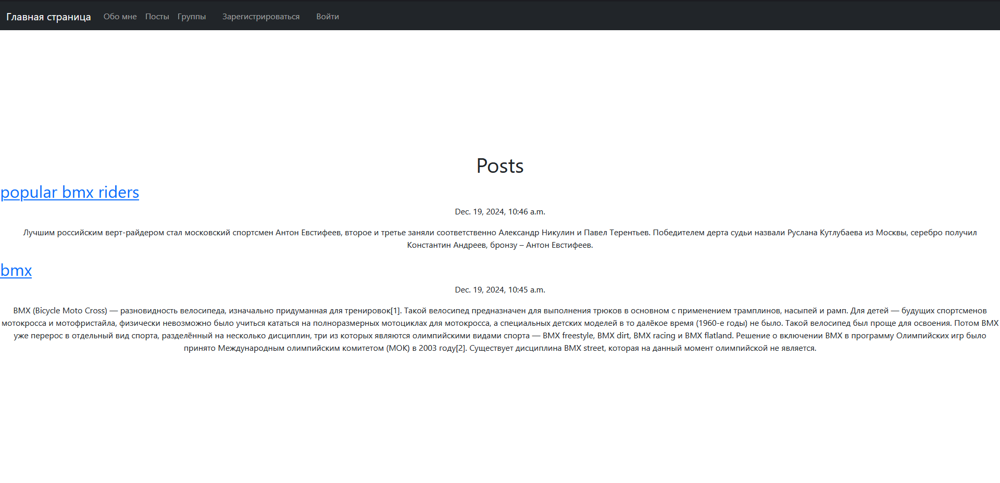
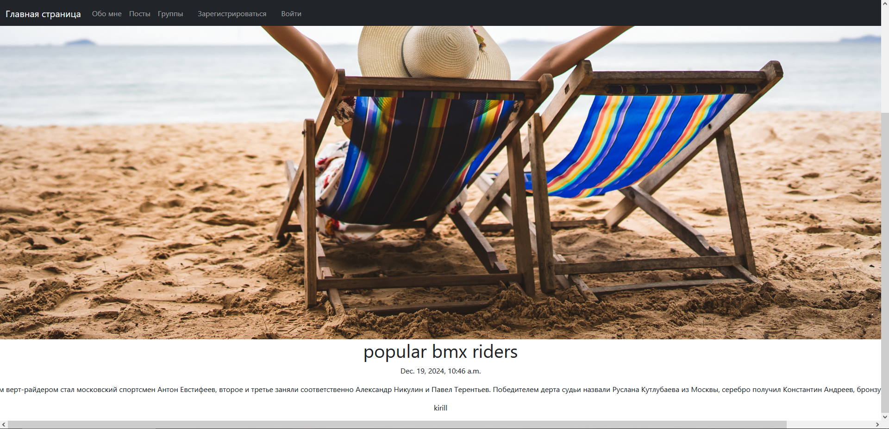
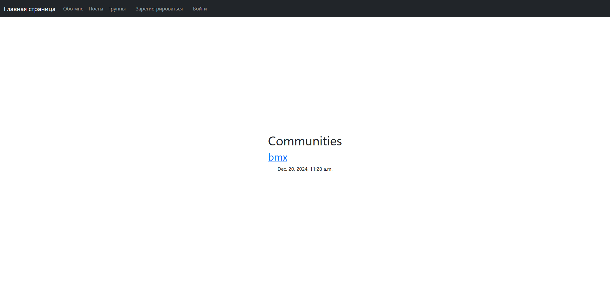
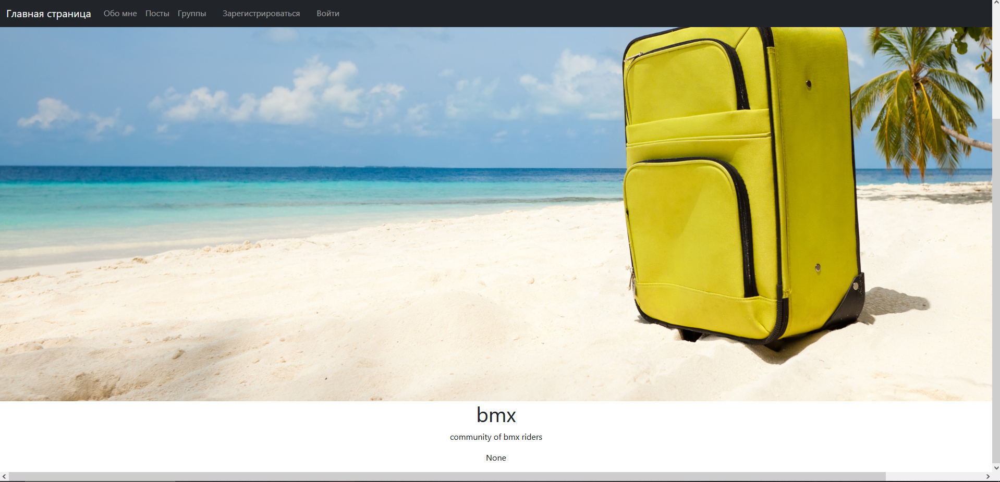
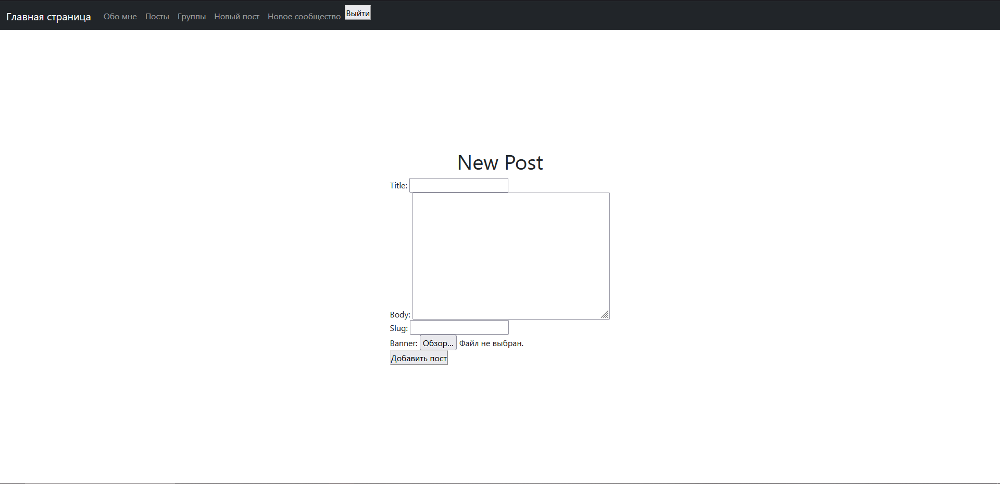
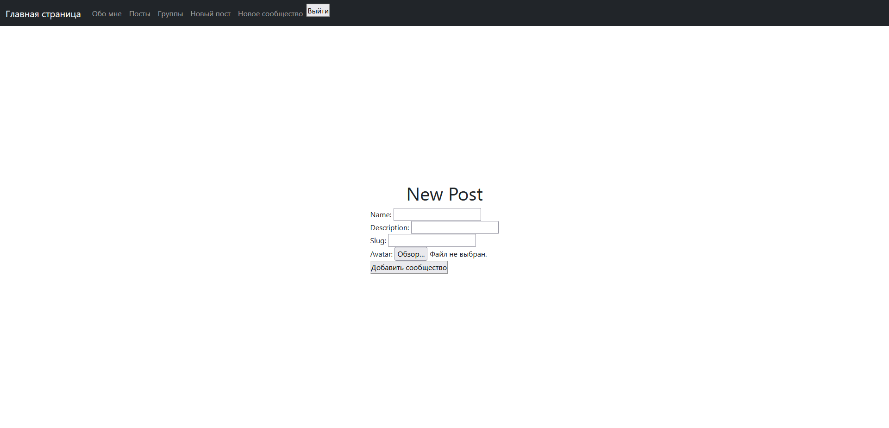
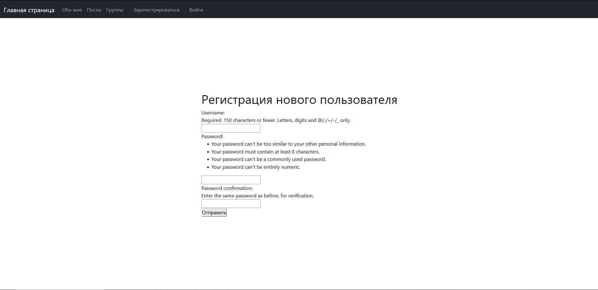
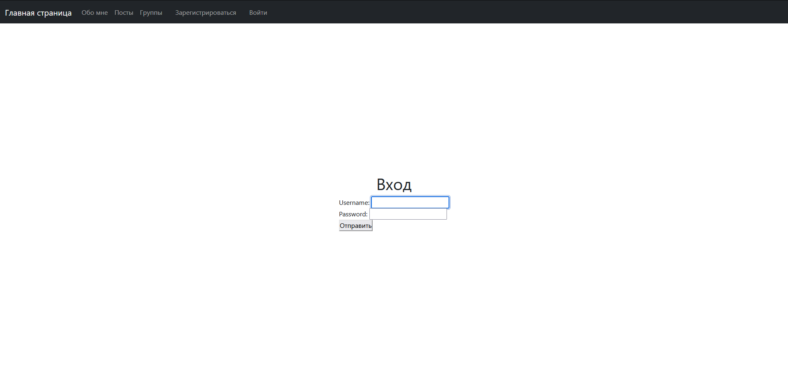

# Social Network Platform | Платформа социальной сети

EN:
A modern social network platform built with Django, featuring user profiles, posts, and communities. This project demonstrates the implementation of a full-featured social network with user authentication, content management, and community features.

RU:
Современная платформа социальной сети, построенная на Django, с профилями пользователей, постами и сообществами. Этот проект демонстрирует реализацию полнофункциональной социальной сети с аутентификацией пользователей, управлением контентом и функциями сообществ.

## Table of Contents | Оглавление

EN:
- [Features](#features--функциональность)
- [Installation](#installation--установка)
- [Project Structure](#project-structure--структура-проекта)
- [Technologies Used](#technologies-used--используемые-технологии)
- [Pages Overview](#pages-overview--обзор-страниц)
  - [Main Page](#main-page--главная-страница)
  - [About Me](#about-me--обо-мне)
  - [Posts](#posts--посты)
  - [Post Detail](#post-detail--детали-поста)
  - [Communities](#communities--сообщества)
  - [Community Detail](#community-detail--детали-сообщества)
  - [Create Post](#create-post--создание-поста)
  - [Create Community](#create-community--создание-сообщества)
  - [Registration](#registration--регистрация)
  - [Login](#login--вход)
- [Contributing](#contributing--участие-в-разработке)

RU:
- [Функциональность](#features--функциональность)
- [Установка](#installation--установка)
- [Структура проекта](#project-structure--структура-проекта)
- [Используемые технологии](#technologies-used--используемые-технологии)
- [Обзор страниц](#pages-overview--обзор-страниц)
  - [Главная страница](#main-page--главная-страница)
  - [Обо мне](#about-me--обо-мне)
  - [Посты](#posts--посты)
  - [Детали поста](#post-detail--детали-поста)
  - [Сообщества](#communities--сообщества)
  - [Детали сообщества](#community-detail--детали-сообщества)
  - [Создание поста](#create-post--создание-поста)
  - [Создание сообщества](#create-community--создание-сообщества)
  - [Регистрация](#registration--регистрация)
  - [Вход](#login--вход)
- [Участие в разработке](#contributing--участие-в-разработке)

## Features | Функциональность

EN:
- User authentication and profiles
- Post creation and management
- Community creation and management
- Media file uploads
- Responsive design
- User interactions (likes, comments)
- Navigation system
- User-friendly interface

RU:
- Аутентификация и профили пользователей
- Создание и управление постами
- Создание и управление сообществами
- Загрузка медиафайлов
- Адаптивный дизайн
- Взаимодействие пользователей (лайки, комментарии)
- Система навигации
- Пользовательский интерфейс

## Installation | Установка

EN:
1. Clone the repository
2. Create and activate virtual environment:
```bash
python -m venv .venv
source .venv/bin/activate  # Linux/Mac
.venv\Scripts\activate     # Windows
```
3. Install dependencies:
```bash
pip install -r requirements.txt
```
4. Run migrations:
```bash
python manage.py migrate
```
5. Create superuser (optional):
```bash
python manage.py createsuperuser
```
6. Run the development server:
```bash
python manage.py runserver
```

RU:
1. Клонируйте репозиторий
2. Создайте и активируйте виртуальное окружение:
```bash
python -m venv .venv
source .venv/bin/activate  # Linux/Mac
.venv\Scripts\activate     # Windows
```
3. Установите зависимости:
```bash
pip install -r requirements.txt
```
4. Выполните миграции:
```bash
python manage.py migrate
```
5. Создайте суперпользователя (опционально):
```bash
python manage.py createsuperuser
```
6. Запустите сервер разработки:
```bash
python manage.py runserver
```

## Project Structure | Структура проекта

```
lab1/
├── users/           # User management app
├── posts/           # Post management app
├── communities/     # Community management app
├── templates/       # HTML templates
├── static/         # Static files (CSS, JS, images)
├── media/          # User-uploaded files
├── assets/         # Additional assets
└── manage.py       # Django management script
```

## Technologies Used | Используемые технологии

EN:
- Python 3.x
- Django
- SQLite
- HTML/CSS
- JavaScript
- Bootstrap (for responsive design)

RU:
- Python 3.x
- Django
- SQLite
- HTML/CSS
- JavaScript
- Bootstrap (для адаптивного дизайна)

## Pages Overview | Обзор страниц

### Main Page | Главная страница


EN:
The main page serves as the entry point to the social network. It features a navigation header with links to various sections and dynamic content based on user authentication status.

RU:
Главная страница служит входной точкой в социальную сеть. Она содержит навигационный заголовок со ссылками на различные разделы и динамический контент в зависимости от статуса аутентификации пользователя.

### About Me | Обо мне


EN:
A personal profile page that can be customized by users to share information about themselves.

RU:
Персональная страница профиля, которую пользователи могут настроить для обмена информацией о себе.

### Posts | Посты


EN:
A feed displaying all posts with their titles and descriptions, allowing users to browse through content.

RU:
Лента, отображающая все посты с их заголовками и описаниями, позволяющая пользователям просматривать контент.

### Post Detail | Детали поста


EN:
Detailed view of a single post, including the image, author information, upload date, description, and title.

RU:
Подробный просмотр отдельного поста, включая изображение, информацию об авторе, дату загрузки, описание и заголовок.

### Communities | Сообщества


EN:
A list of all communities with their names and descriptions, allowing users to discover and join groups.

RU:
Список всех сообществ с их названиями и описаниями, позволяющий пользователям находить и присоединяться к группам.

### Community Detail | Детали сообщества


EN:
Detailed view of a community, featuring the community image, creator information, creation date, description, and name.

RU:
Подробный просмотр сообщества, включающий изображение сообщества, информацию о создателе, дату создания, описание и название.

### Create Post | Создание поста


EN:
Form for creating new posts with fields for title, body (description), slug (URL-friendly name), and banner image.

RU:
Форма для создания новых постов с полями для заголовка, текста (описания), slug (URL-дружественное имя) и изображения баннера.

### Create Community | Создание сообщества


EN:
Form for creating new communities with fields for name, description, slug, and avatar image.

RU:
Форма для создания новых сообществ с полями для названия, описания, slug и изображения аватара.

### Registration | Регистрация


EN:
User registration form with fields for username and password with confirmation.

RU:
Форма регистрации пользователя с полями для имени пользователя и пароля с подтверждением.

### Login | Вход


EN:
User login form with fields for username and password.

RU:
Форма входа пользователя с полями для имени пользователя и пароля.

## Contributing | Участие в разработке

EN:
1. Fork the repository
2. Create your feature branch
3. Commit your changes
4. Push to the branch
5. Create a new Pull Request

RU:
1. Сделайте форк репозитория
2. Создайте ветку для вашей функции
3. Зафиксируйте изменения
4. Отправьте изменения в ветку
5. Создайте новый Pull Request


